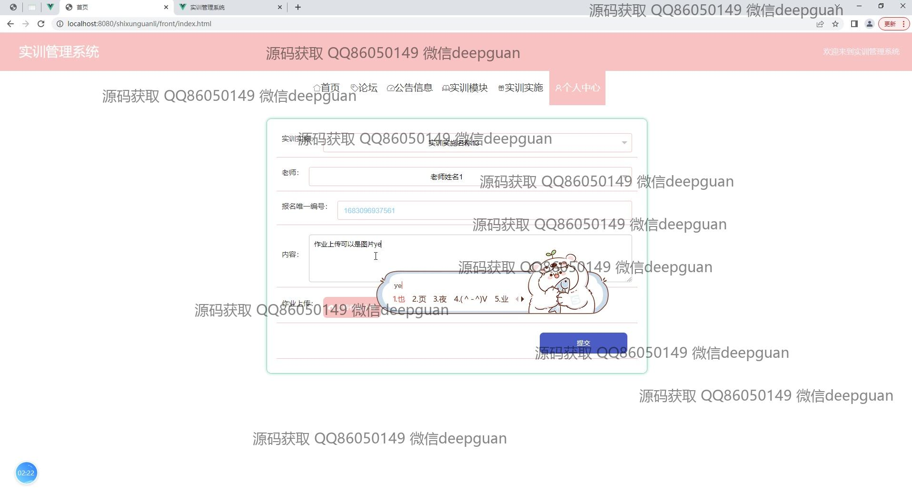
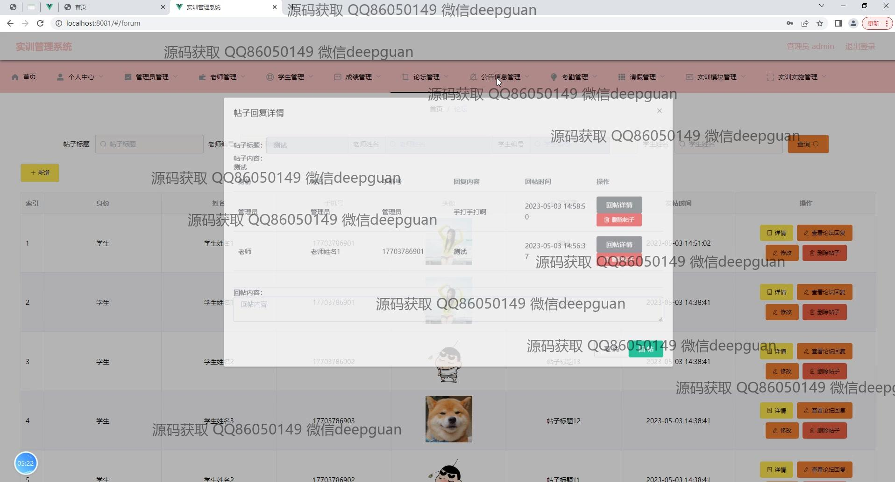
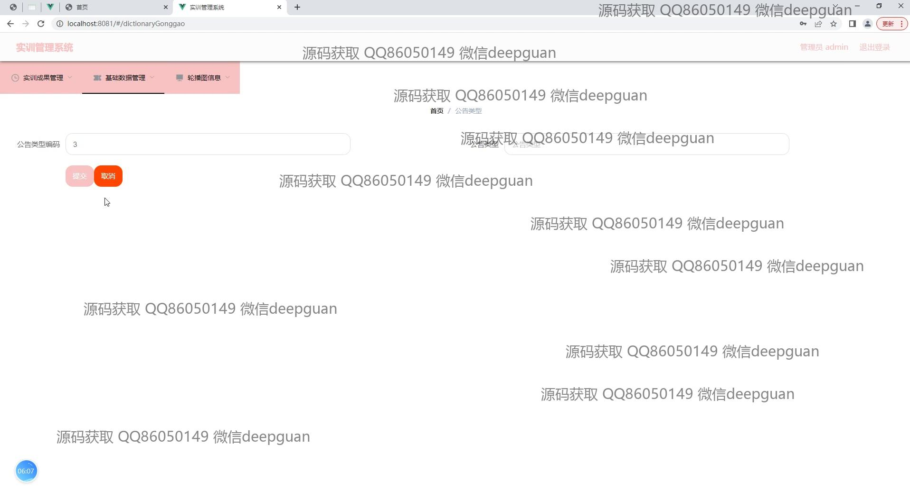

<h1 align="center">实训管理系统的设计与实现</h1>

## 简介
实训管理系统：角色分为管理员、教师、学生；功能包括论坛互动、信息公告、实训模块管理、考勤管理、作业提交与批改、成绩查询与管理、轮播图配置、用户管理及数据统计与报表生成。    --计算机毕业设计源码；毕设源码；java毕业设计源码

## 联系方式

<h3 align="center">获取完整代码与数据库文件 + 微信：deepguan QQ: 86050149 QQ群: 783742310</h3>

<h3 align="center">可帮忙远程部署 包运行成功！提供远程部署、修改代码、设计文档指导、代码讲解等服务！</h3>

## 功能介绍（完整见运行截图）
管理员：管理员可以通过实训管理系统进行用户登录和管理实训模块、成绩、考勤及请假信息。系统提供导航栏，支持基础数据管理、公告信息管理和轮播图配置等功能，可以上传图片和设置轮播图，还能管理学生、教师及实训项目的信息和成绩。管理员能够筛选、查看及修改学生信息，执行数据统计与报表生成，优化实训项目的管理和展示。

教师：教师登录系统后，可以管理课程信息和学生成绩，还可以查看实训实施地、教师信息、照片及视频上传状态等。通过查看详细的学生作业和考勤记录，教师可以为作业打分并提交考勤结果。系统允许教师发布实训项目并批改作业，帮助他们更高效地实现教学管理。

学生：学生可以通过系统进行账号注册和登录，查询和提交作业，查看自己的实训进度、成绩和考勤记录。学生信息管理界面允许输入和查看个人账户信息，头像和联系方式。学生能够浏览并上传作业，查看已提交作业的审核状态，提高对实训过程的掌控和参与度。

用户：用户可以登录系统访问个人中心和各类管理模块，系统提供查看和添加评论、发布帖子及留言等论坛功能，提升用户间的互动交流。用户还可以通过请假管理模块申请请假，系统为每个用户提供个人信息查看与修改，简化个人事务与实训安排的管理。

## 运行截图

本代码来源于网络,仅供学习参考使用!

